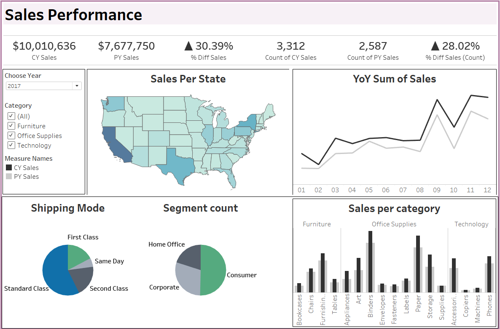

# Sales Performance Dashboard

This Tableau dashboard provides a comprehensive overview of sales performance for a company selling various products across the United States. It offers insights into key metrics such as total sales, sales by product category, regional performance, and sales trends over time, enabling stakeholders to make data-driven decisions.

## Project Overview

The **Sales Performance Dashboard** was designed to help the company understand sales dynamics by focusing on the following objectives:

- **Analyze total sales** across different product categories.
- **Identify top-performing regions** within the United States.
- **Examine trends** in sales over time to spot growth opportunities.
- **Evaluate product performance**, allowing the company to optimize inventory and marketing strategies.

## Key Features

- **Dynamic Filters**: Interact with filters to view sales data by specific product categories, regions, and time periods.
- **Sales Breakdown by Product Category**: Provides a quick overview of the contribution of each product category to overall sales.
- **Regional Sales Heatmap**: Highlights sales distribution across the U.S., enabling a clear view of regional performance.
- **Trend Analysis**: Includes a time series graph to visualize sales trends over selected time frames.

## Project Details

- **Tool**: Tableau
- **Dataset**: Company sales data from different U.S. regions (sample data for project demonstration)
- **Skills Demonstrated**: Data visualization, trend analysis, filtering techniques, and Tableau dashboard design

## Dashboard Link

You can explore the live dashboard on Tableau Public: [Sales Performance Dashboard](https://public.tableau.com/views/SalesPerformancedashboard_17308819287430/Dashboard2?:language=en-US&:sid=&:redirect=auth&:display_count=n&:origin=viz_share_link)

## Insights Gained

This dashboard provides actionable insights into product sales across different regions and categories, helping identify high-performing areas and potential growth opportunities. These insights can be applied to optimize product strategies and better align resources with demand.
